## Introduction
Influenza A virus (IAV) is a major respiratory pathogen, responsible for an estimated 290,000 to 650,000 influenza associated respiratory deaths worldwide each year.1 The nasal mucosa serves as the primary site of exposure to IAV infection in mammals, yet immune responses at this site remain poorly understood.2 In mice, the nasal mucosa is composed of three functionally distinct regions: the respiratory mucosa (RM), olfactory mucosa (OM), and lateral nasal gland (LNG).3 Following IAV infection, immune cells within the nasal mucosa detect the virus and initiate an antiviral response through the production of interferons (IFNs), which in turn activate interferon stimulated genes (ISGs).4,5 This immune response occurs in a coordinated, temporal manner, beginning with the recruitment of neutrophils at 2 days post infection (dpi), followed by monocytes and natural killer (NK) cells at 5 dpi, macrophages and T cells at 8 dpi, and finally the establishment of memory immune cells by 14 dpi that support long term protection.3

Single-cell RNA sequencing (scRNA-seq) enables gene expression profiling at the individual cell level, overcoming the limitation of bulk RNA-seq, which measures only the average expression signal across an ensemble of cells.6,7 Seurat and Scanpy are the two most widely used platforms for scRNA-seq data analysis.8 Seurat was selected for this analysis due to its native compatibility with downstream R-based statistical tools used in this study, including DESeq2 for pseudobulk differential expression9 and clusterProfiler for functional enrichment analysis.10 Cell type annotation was performed using SingleR with the ImmGen mouse immune cell reference dataset.11

This study reanalyzed a scRNA-seq dataset generated by Kazer et al.,3 comprising 156,572 single-cell transcriptomes from three nasal tissue regions across five time points (naive, 2, 5, 8, and 14 dpi) during primary IAV H1N1 PR8 infection, with three biological replicates per group.3 The objective was to characterize the cellular landscape of the nasal mucosa during IAV infection and identify differentially expressed genes and enriched pathways in macrophages at peak viral load compared to baseline.

## Methods

### Computational resources  
Analyses were run on the Digital Research Alliance of Canada’s Nibi cluster (R v4.5.0, 128 GB RAM, 4 CPUs).

### Data source and preprocessing  
A pre-processed Seurat object containing scRNA-seq data from Kazer et al.3 was provided by the course instructor, consisting of 156,572 single-cell transcriptomes across 25,129 genes from murine nasal mucosa at five time points (naive, 2, 5, 8, 14 dpi) across three tissue regions (RM, OM, LNG), with three biological replicates per group. Approximately 36% of cells lacked confident mouse identity assignments and were retained for clustering but excluded from pseudobulk differential expression analysis.

### Quality control  
Mitochondrial content was calculated using `PercentageFeatureSet` in Seurat v5.4.0 12 with pattern `"^mt-"`. Cells were filtered to retain those with 200–6,000 detected genes and <20% mitochondrial reads (156,545 cells retained). The lower bound removes empty droplets, the upper bound excludes doublets, and the mitochondrial threshold removes dying cells.13

### Normalization, scaling, and dimensionality reduction  
Counts were log-normalized using `NormalizeData` (`scale.factor = 10000`, default), which normalizes each cell’s counts by total expression, multiplies by 10,000, and log-transforms the result. The top 2,000 highly variable genes were identified using `FindVariableFeatures` (`method = "vst"`, default), which models the mean–variance relationship to select genes varying beyond noise. Data were scaled using `ScaleData` prior to PCA to prevent highly expressed genes from dominating principal components.13  

Twenty-five principal components were retained based on elbow plot inspection.

### Clustering and visualization  
A shared nearest-neighbor graph was constructed using `FindNeighbors` (`dims = 1:25`) and cells were clustered using `FindClusters` (`resolution = 0.3`, default Louvain algorithm), yielding 28 clusters.12 Resolution 0.3 was selected to capture major cell types without over-partitioning. UMAP was used for visualization due to its ability to preserve global structure relative to t-SNE.14 No batch correction was applied as cells clustered primarily by cell type rather than sample or condition.

### Marker identification and annotation  
Cluster markers were identified using `FindAllMarkers` (`min.pct = 0.25`, `logfc.threshold = 0.25`, `only.pos = TRUE`), which applies more stringent thresholds than Seurat defaults to reduce low-expression or weakly differential genes.12  

Automated annotation was performed using `SingleR`11 with the ImmGen reference from celldex,15 which contains microarray profiles of 830 purified mouse immune cell populations.16 Annotations were refined manually using `FeaturePlot` and marker gene `DotPlot` visualizations to correct misassigned non-immune clusters.

### Differential expression and enrichment  
Pseudobulk differential expression was performed on macrophages (D05 vs naive) by aggregating cells per replicate using `AggregateExpression` and testing with DESeq2,9 which accounts for within-replicate non-independence that can inflate false discovery rates in single-cell analyses.17  

Significance was defined as adjusted p < 0.05 and |log₂FC| > 1. Over-representation analysis (ORA) and gene set enrichment analysis (GSEA) were performed using clusterProfiler¹⁰ with GO:BP terms and the `org.Mm.eg.db` annotation database,14 restricting gene sets to 10–500 genes to exclude poorly defined or overly broad pathways.

## Results
The dataset contained 156,572 cells across 25,129 genes. Filtering by gene count (200–6,000) and mitochondrial content (<20%) retained 156,545 cells. QC metrics were consistent across all five time points, with the majority of cells exhibiting mitochondrial fractions below 5% (Figure 1).

  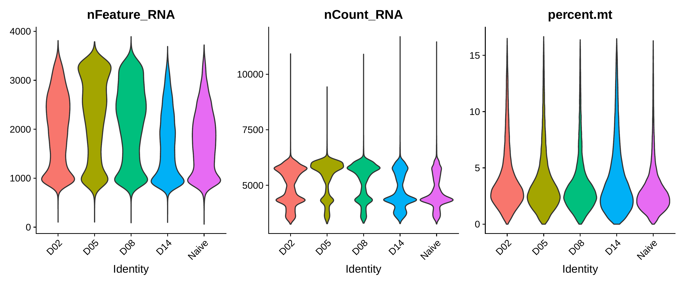

  <em><strong>Figure 1.</strong> Violin plots of quality control metrics across time points. Distributions of detected genes (nFeature_RNA), total UMI counts (nCount_RNA), and mitochondrial gene percentage (percent.mt) are shown for each condition (D02, D05, D08, D14, naive). The width of each violin reflects the density of cells at a given value.</em>

Clustering at resolution 0.3 identified 28 clusters. UMAP visualization showed clear separation between immune, epithelial, olfactory, and stromal populations (Figure 2). Splitting by tissue type revealed tissue-restricted populations, with olfactory sensory neurons appearing exclusively in OM samples (Figure 3). Splitting by time point showed expansion of immune cell clusters at D05–D08 (Figure 4). Cells from different time points and samples were intermixed within clusters, indicating no observable batch effects.

  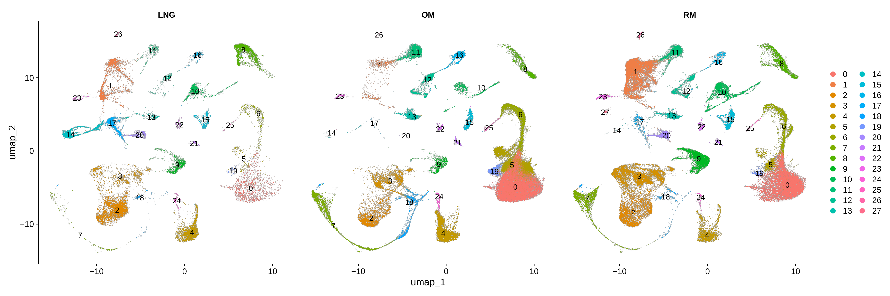

  <em><strong>Figure 2.</strong> UMAP visualization split by tissue region (LNG, OM, RM). Each point represents a single cell positioned by transcriptional similarity and colored by cluster identity. Clusters are largely conserved across tissues, with differences in relative abundance indicating tissue-specific enrichment of certain cell populations.</em>

  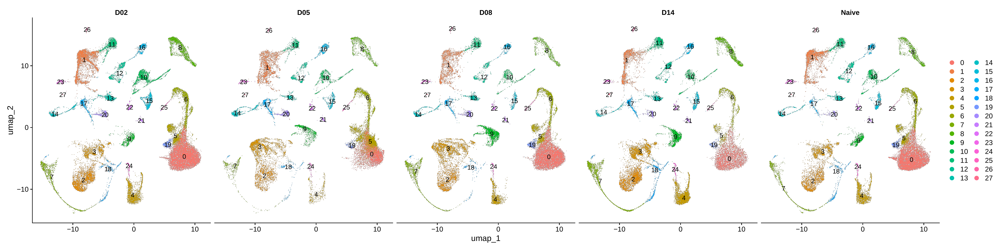

  <em><strong>Figure 3.</strong> UMAP visualization split by time point (D02, D05, D08, D14, naive). Cells are colored by cluster identity. Changes in cluster density across time points indicate expansion of immune-associated clusters during infection and stabilization at later stages.</em>

  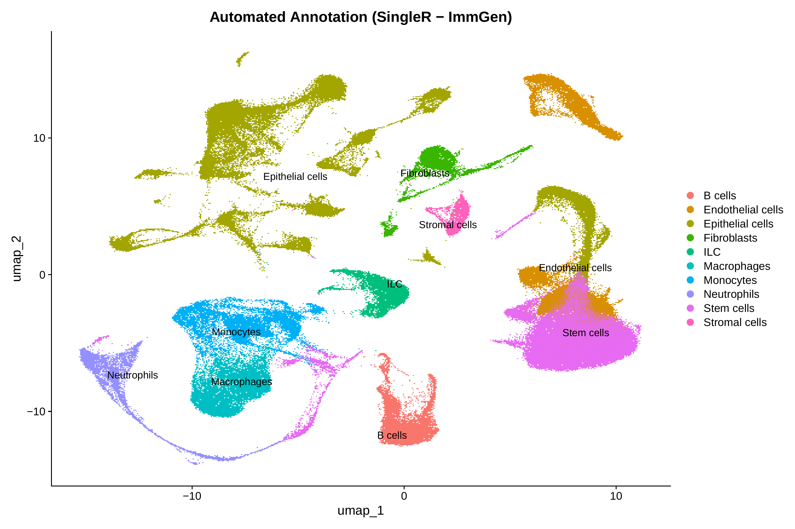

  <em><strong>Figure 4.</strong> UMAP visualization with automated cell type annotation using SingleR and the ImmGen reference. Each point represents a cell colored by predicted cell type. Labels indicate major populations including macrophages, monocytes, neutrophils, epithelial cells, and stromal cells. Some non-immune populations are broadly classified due to limitations of the immune-focused reference.</em>

SingleR automated annotation identified immune populations including macrophages, neutrophils, B cells, and dendritic cells (Figure 5). Non-immune clusters were labeled as "Stem cells" and "ILC" by SingleR. Manual inspection using a DotPlot of established markers (Figure 6) and FeaturePlots showed that the "Stem cells" cluster expressed Omp (olfactory marker protein) and was relabeled as olfactory sensory neurons, while the "ILC" cluster expressed Cd3d and Nkg7 and was relabeled as T/NK cells. The final annotation comprised 12 cell types: macrophages, neutrophils, T/NK cells, T cells, B cells, dendritic cells, epithelial cells, basal cells, olfactory sensory neurons, sustentacular cells, fibroblasts, and endothelial cells (Figure 2).

  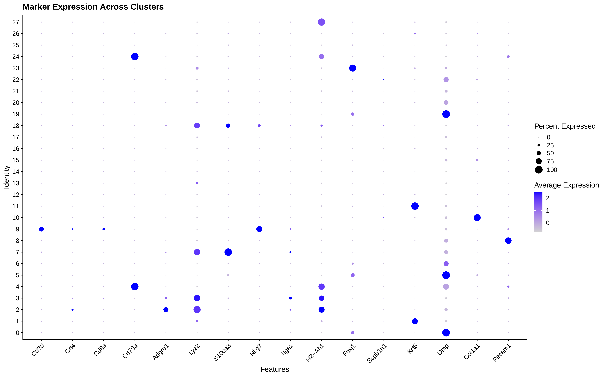

  <em><strong>Figure 5.</strong> Dot plot of canonical marker gene expression across clusters. Each row represents a cluster and each column represents a gene. Dot size indicates the percentage of cells expressing the gene, while color intensity reflects average scaled expression, with darker blue indicating higher expression. Distinct marker patterns confirm identities of immune, epithelial, and olfactory cell populations.</em>

  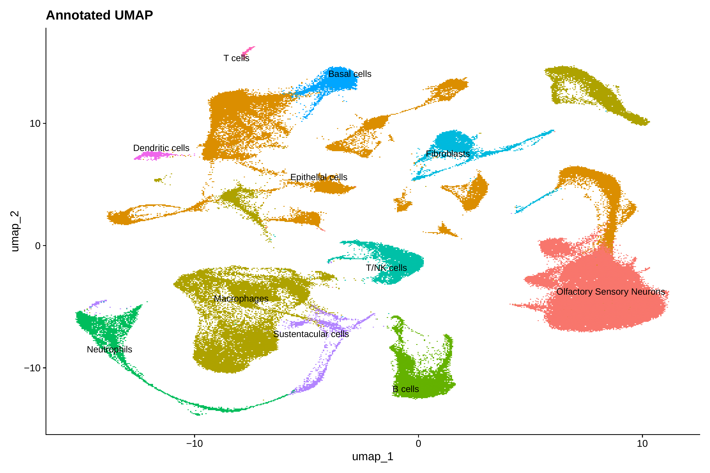

  <em><strong>Figure 6.</strong> UMAP visualization of manually refined cell type annotations. Cells are colored by final assigned identities based on marker gene expression. Labels indicate major populations including macrophages, neutrophils, B cells, T/NK cells, epithelial cells, and olfactory sensory neurons.</em>

Isg15, Ifit1, and Oasl2 expression was concentrated in macrophage and neutrophil clusters (Figure 7). Cxcl10 and Ccl2 were expressed primarily in the macrophage cluster, while Il6 showed low, diffuse expression across multiple populations (Figure 8). Ifng expression was restricted to the T/NK cell cluster, while Stat1 was broadly expressed across macrophage, dendritic cell, and epithelial populations (Figure 9).

  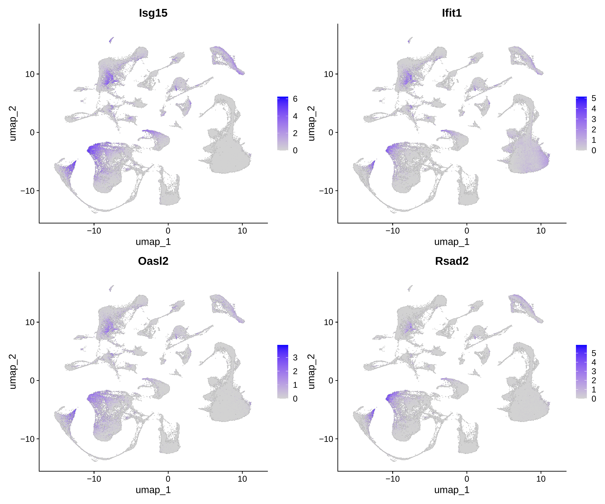

  <em><strong>Figure 7.</strong> Feature plots showing expression of interferon-stimulated genes <em>Isg15</em>, <em>Ifit1</em>, <em>Oasl2</em>, and <em>Rsad2</em>. Color intensity represents normalized expression levels, with darker purple indicating higher expression. These genes are enriched in macrophage and neutrophil clusters.</em>

  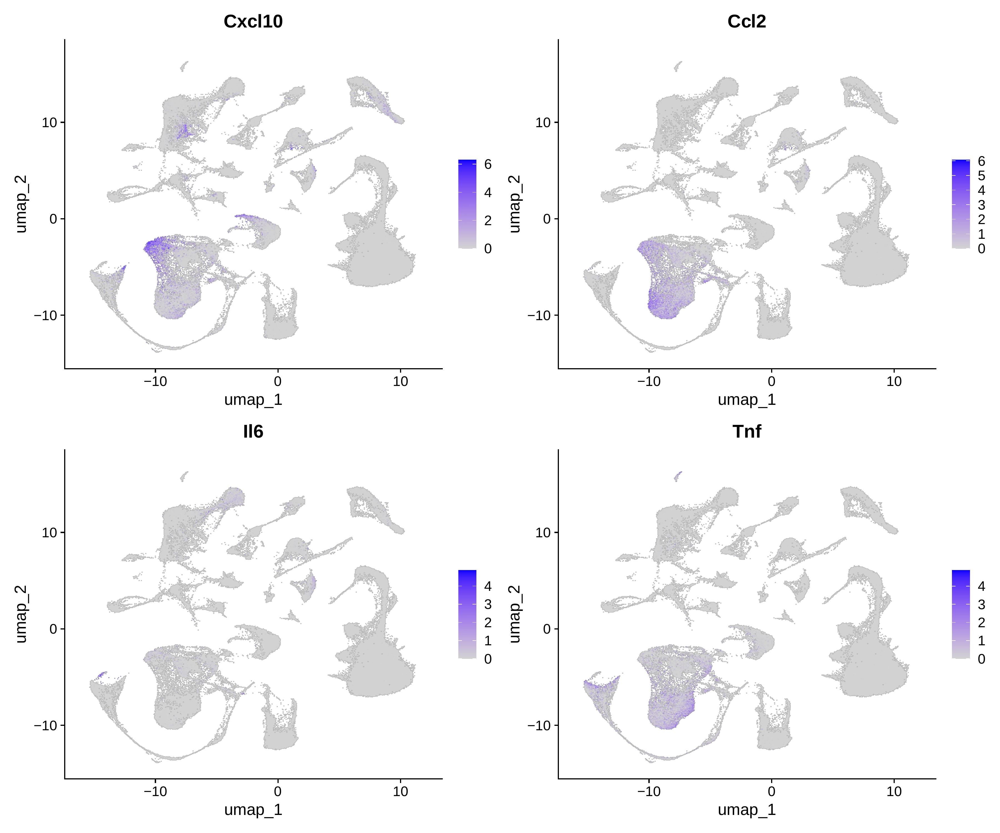

  <em><strong>Figure 8.</strong> Feature plots of cytokine and chemokine expression, including <em>Cxcl10</em>, <em>Ccl2</em>, <em>Il6</em>, and <em>Tnf</em>. Color intensity represents normalized expression levels. Expression is concentrated in macrophage-rich regions.</em>

  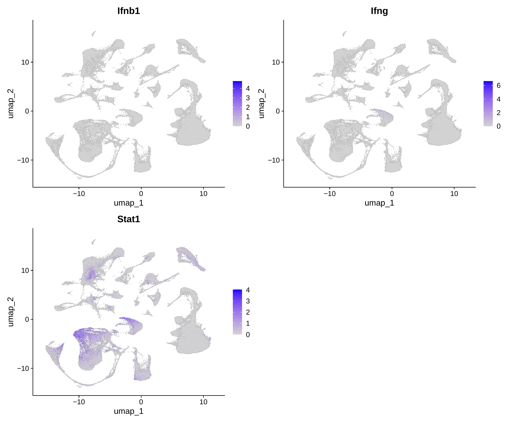

  <em><strong>Figure 9.</strong> Feature plots of antiviral signaling genes <em>Ifnb1</em>, <em>Ifng</em>, and <em>Stat1</em>. Color intensity represents normalized expression levels. <em>Ifng</em> expression is restricted to lymphocyte populations, while <em>Stat1</em> shows broader expression.</em>

Pseudobulk analysis of macrophages (D05 vs Naive) identified 62 significant genes (adjusted p < 0.05, |log₂FC| > 1). Of these, 61 were upregulated and one (Sox18, log₂FC = −1.44) was downregulated. The top upregulated genes were Ifit2 (log₂FC = 2.93), Ifit3 (2.70), Isg15 (2.70), Irf7 (2.60), Oasl1 (2.45), and Ifit1 (2.29).

ORA of the 62 significant DE genes identified 128 enriched GO biological process terms (Figure 10). The top terms were "defense response to virus" (26 genes, adjusted p = 6.92 × 10⁻³¹) and "response to virus" (27 genes, adjusted p = 3.06 × 10⁻³⁰). GSEA identified 390 enriched gene sets, of which 330 were positively enriched and 60 were negatively enriched (Figure 11). The most positively enriched terms were "response to interferon-beta" (NES = +2.28) and "negative regulation of viral process" (NES = +2.18). The most negatively enriched terms were "translation at presynapse" (NES = −2.88) and "translation at synapse" (NES = −2.85).

  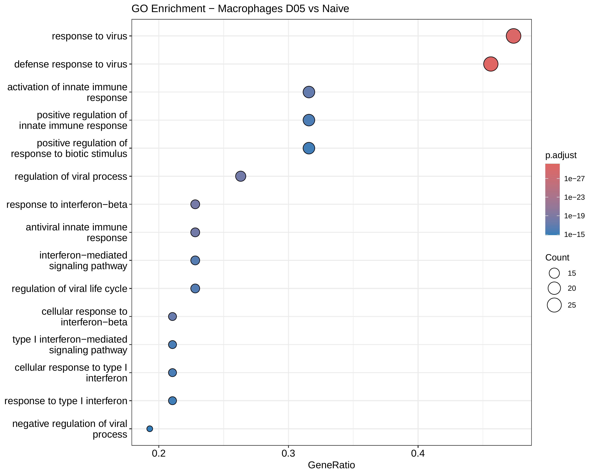

  <em><strong>Figure 10.</strong> Over-representation analysis of differentially expressed genes in macrophages (D05 vs naive). Each dot represents a GO biological process. The x-axis shows the gene ratio, dot size indicates the number of genes contributing to the term, and color reflects adjusted p-value.</em>

  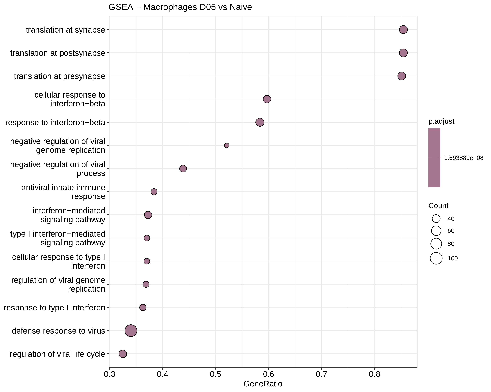

  <em><strong>Figure 11.</strong> Gene set enrichment analysis of ranked genes in macrophages (D05 vs naive). Each dot represents an enriched pathway. The x-axis shows the gene ratio, dot size indicates gene set size, and color reflects adjusted p-value. Upregulated pathways are associated with antiviral defense and interferon signaling, while other pathways reflect cellular regulatory processes.</em>

Immune cell proportions, particularly macrophages and neutrophils, increased from D02 through D08 and decreased at D14 (Figure 12). Epithelial and olfactory populations remained proportionally stable across all time points.

  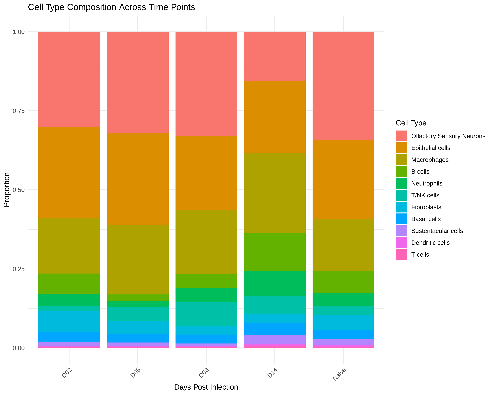

  <em><strong>Figure 12.</strong> Cell type composition across time points. Stacked bar plots show the proportion of each annotated cell type within each condition (D02, D05, D08, D14, naive). Each bar sums to 1, and colored segments represent relative abundance of cell types. Immune populations, including macrophages and neutrophils, increase at intermediate time points, while epithelial and olfactory populations remain relatively stable.</em>

